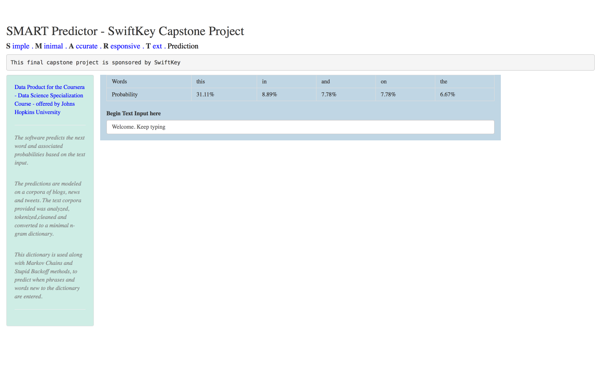

SMART Predictor
========================================================
author: Rohit Padebettu
date: 26-December-2016

*A Coursera-SwiftKey Final Capstone Project*

Introduction
========================================================
title: false

**GOAL** 
- To build a Shiny App which takes in a user input word, phrase or sentence and predicts the next word

**DATASET**
- The data is from a corpus called HC Corpora. It is organized into 3 text files blogs, news and tweets.

**MODELING CHALLENGES**
- Use R's NLP infrastructure such as `stringi`, `ngram`,`tm`,`quanteda` to build prediction model

**DESIGN CHALLENGES**
- App needs to be Light, Fast and Accurate

Algorithm
========================================================
title:false
type: sub-section

**Algorithm**

- Simple N-gram based search : *Used upto quadgrams*
- Markov Chain and Stupid Backoff : *To predict new phrases*
- Stupid Backoff at Character level : *To predict new words*
- Smart Search : 
    1. Search Quadgrams
    2. Search Trigrams
    3. Search Hi-Frequency Bigrams
    4. Search Lo-Frequency Bigrams
- Prune Dictionary : *To limit resource utilization*

***

**In sample Accuracy**

|Ngram     | Accuracy|
|:---------|--------:|
|Bi-gram   |    0.157|
|Tri-gram  |    0.350|
|Quad-gram |    0.610|

**Data Description**

|File              | Size(MB)|  Length|    Words|
|:-----------------|--------:|-------:|--------:|
|en_US.blogs.txt   | 200.4242|  899288| 37334131|
|en_US.news.txt    | 196.2775| 1010242| 34372530|
|en_US.twitter.txt | 159.3641| 2360148| 30373583|

A Shiny App
========================================================
type:prompt
left:20%
title:false

[SHINY APP](https://rpadebet.shinyapps.io/SwiftKeyTextPredictor/)

- **S**imple

- **M**inimal

- **A**ccurate

- **R**esponsive

- **T**ext prediction

**NO MORE BUTTONS TO PRESS!!**

***

**SMART Predictor**

[https://rpadebet.shinyapps.io/SwiftKeyTextPredictor/]

Further Improvements
========================================================

- **Smarter & Smaller dictionaries**

- **Faster Search & Match logic**

- **User Adaptive Predictions**

- **More Useful Predictions**    
    - *Multiple word phrases? Synonyms?*

- **Contextual Predictions**     
    - *Blog, News, Tweets, Positive/Negative Sentiment, Location*

- **Environment driven Speed vs Accuracy tradeoff** 
    - *Mobile vs PC vs Supercomputer*
